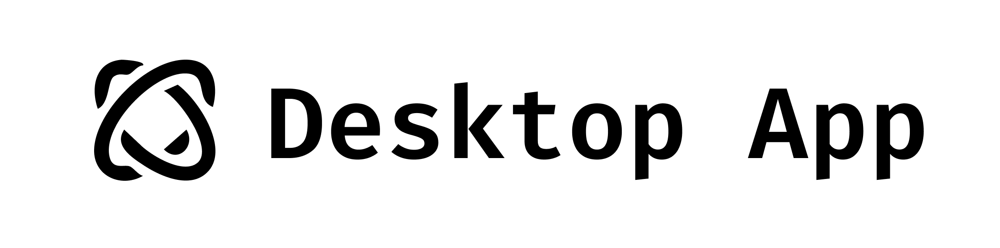

 

This project is designed to make websites accessible for AI agents and builds upon the foundation of [browser-use](https://github.com/browser-use/browser-use) + [web-ui](https://github.com/browser-use/web-ui).

**UI:** is built on Electron and Gradio and supports most `browser-use` functionalities. This UI is designed to be user-friendly and enables easy interaction with the browser agent.

**Expanded LLM Support:** We've integrated support for various Large Language Models (LLMs), including: Google, OpenAI, Azure OpenAI, Anthropic, DeepSeek, Ollama etc. And we plan to add support for even more models in the future.

**Custom Browser Support:** The desktop app uses your existing Google Chrome browser, eliminating the need to re-login to sites or deal with other authentication challenges. This feature also supports high-definition screen recording.

## Download

- Download for macOS *(Coming soon...)*
- Download for Windows *(Coming soon...)*
- Download for Linux *(Coming soon...)*
